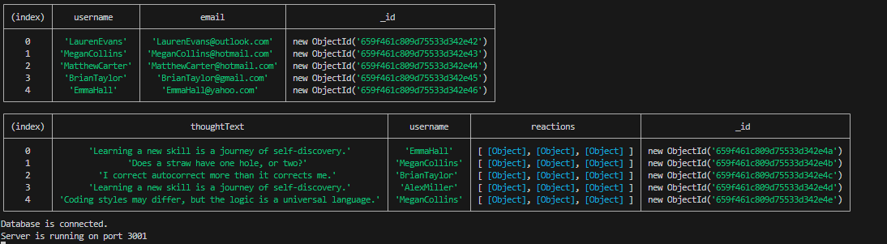
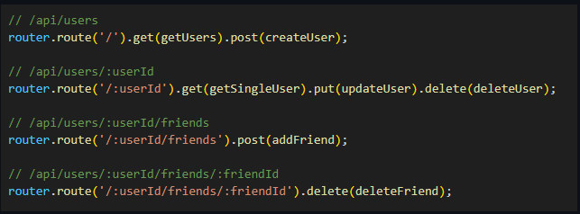
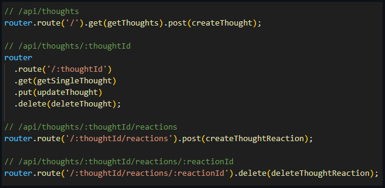
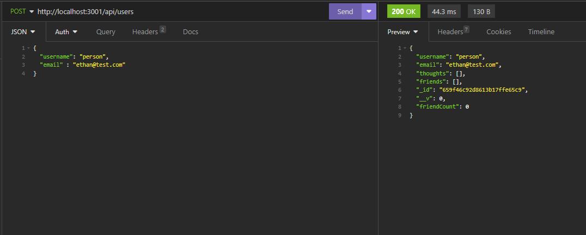
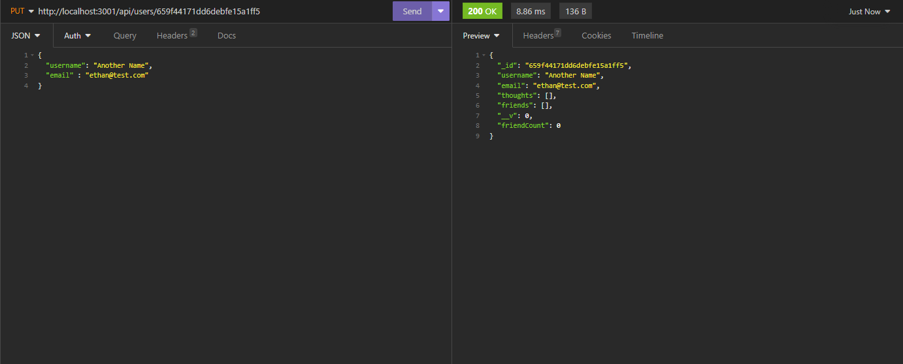
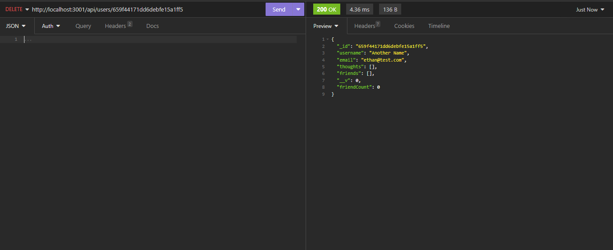

# NoSQL Social Network Api

[Video Demonstration]([https://drive.google.com/file/d/1AwUZFLC6P6qMTxxx2EXnbsaT2kUIJ5VH/view])

## Description

This app allows you to use a noSQL database to provide a place to create thoughts. People can react to those thoughts, and add other users to their friend lists. All of this was done though the use of the `mongoose`, `express`, and `node.js`. The backend routes handle the `GET`, `POST`, `PUT`, and `DELETE` routes. The video shows off all of the routes being tested in `Insomnia`.

## Table of contents

- [Installation](#installation)
- [Usage](#usage)
- [License](#license)
- [Questions](#questions)

## Installation

1. Clone the repository from `GitHub`
2. Install or have `Node.js`, installed.
3. Open the cloned repository in VSCode.
4. Open the project inside the integrated terminal.
5. Use the command `npm i` to install all package dependencies.
   (This will install the modules `express` and `mongoose`.)

## Usage

1. Seed the data using the `node utils/seeds.js` command in the terminal.
2. Also input `node server.js` to start the server.
3. Open up `Insomnia` and all of the API routes can be tested there.
4. GET, POST, PUT, and DELETE routes can be tested for users, thoughts, reactions and friends.
5. All requests are sent using the command `localhost:3001/api/<route>` within `Insomnia`.
6. All routes are queried through either `api/users` or `api/thoughts` in the `routes/api` folder.

### Example Seed/Start Server

### User and Thought API Routes

### Example GET Route

### Example POST Route

### Example PUT Route

### Example DELETE Route

## License

Licensed under [MIT](https://opensource.org/license/mit/)

## Questions

You are welcome to contact me with questions using the following:

- [GitHub Profile](https://github.com/ethancs13)

- [Email](mailto:ethansroka@gmail.com)
